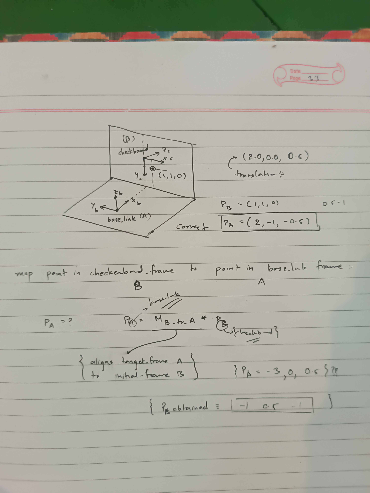

# Transformation of coordinate

  

  <i>Fig. 3D coordinate transformation from one frame to another</i>

## The Problem
I know coordinate of a point say P w.r.t. frame_B (checkboard_origin). And, I have transformation from frame_A (base_link) to frame_B i.e. translation \<position> and yaw_pitch_roll \<orientation>. **What is the coordinate of point P w.r.t. frame_A?**

***An example:***  
**Point** $P_B=\begin{pmatrix}1\cr1\cr0\end{pmatrix}$  
**Translation** $t_{A2B}=\begin{pmatrix}2&0&0.5\end{pmatrix}$  
**Orientation** $ypr_{A2B}=\begin{pmatrix}-\frac{\pi}{2}&0&-\frac{\pi}{2}\end{pmatrix}$  

## The Solution
1. Get transformation matrix $T_{4\times4}$ from $O_A$ to $O_B$
    - Initialise transformation matrix as identity matrix  
      $T=\begin{bmatrix}1&0&0&0\cr0&1&0&0\cr0&0&1&0\cr0&0&0&1\end{bmatrix}$
    - Get rotation matrix $R_{3\times3}$  from yaw, pitch, roll  
      $R=\begin{bmatrix}0&0&1\cr-1&0&0\cr0&-1&0\end{bmatrix}$  
      Rotation matrix maps orthonormal basis vectors of $O_A$ to that of $O_B$ i.e.  
      $\hat{i}_{B} = \begin{pmatrix}0\cr-1\cr0\end{pmatrix}$ w.r.t. frame_A  
      $\hat{j}_{B} = \begin{pmatrix}0\cr0\cr-1\end{pmatrix}$ w.r.t. frame_A  
      $\hat{k}_{B} = \begin{pmatrix}1\cr0\cr0\end{pmatrix}$ w.r.t. frame_A
    - Get the translation column vector  
      $t = \begin{pmatrix}2\cr0\cr0.5\end{pmatrix}$ from $O_A$ to $O_B$
    - Combine Rotation matrix and translation vector to get transformation matrix  
      $T = \begin{bmatrix}R_{3\times3}&t_{3\times1}\cr0_{1\times3}&1\end{bmatrix}_{4\times4}$  
      $T_{A2B}=\begin{bmatrix}0&0&1&2\cr-1&0&0&0\cr0&-1&0&0.5\cr0&0&0&1\end{bmatrix}$

2. Premultiply the point $P_B$ by $T_{A2B}$  
    $P_A = T_{A2B}\times P_B$  
    $P_A = \begin{pmatrix}2\cr-1\cr-0.5\cr1\end{pmatrix}$

3. Dehomogenize obtained point $P_B$ by dividing all elements by $P_A[3]$  
    $P_A = \begin{pmatrix}2\cr-1\cr-0.5\end{pmatrix}$